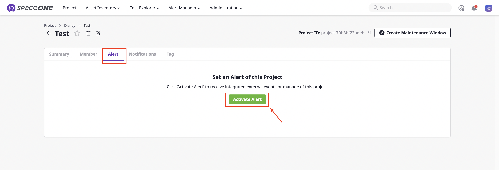
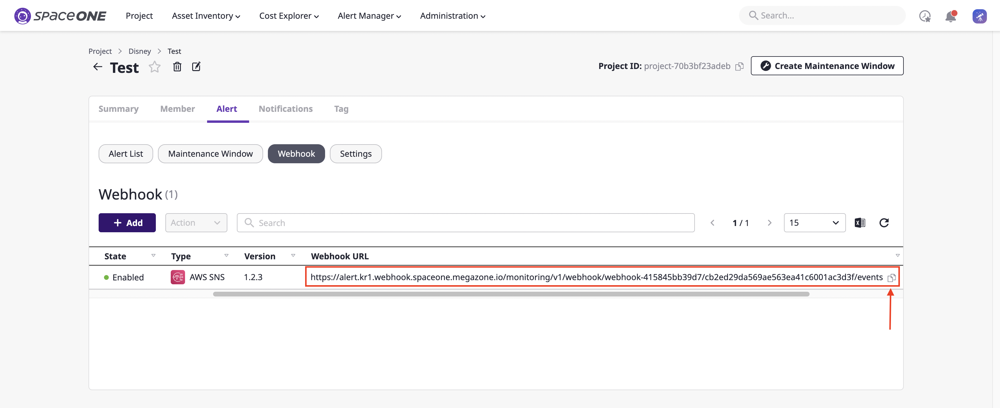
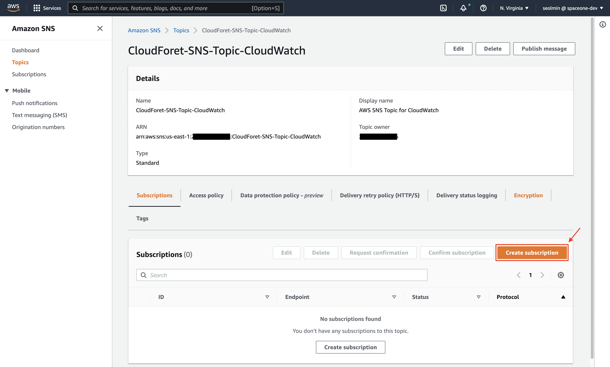
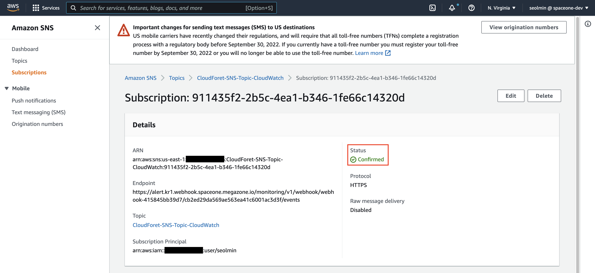
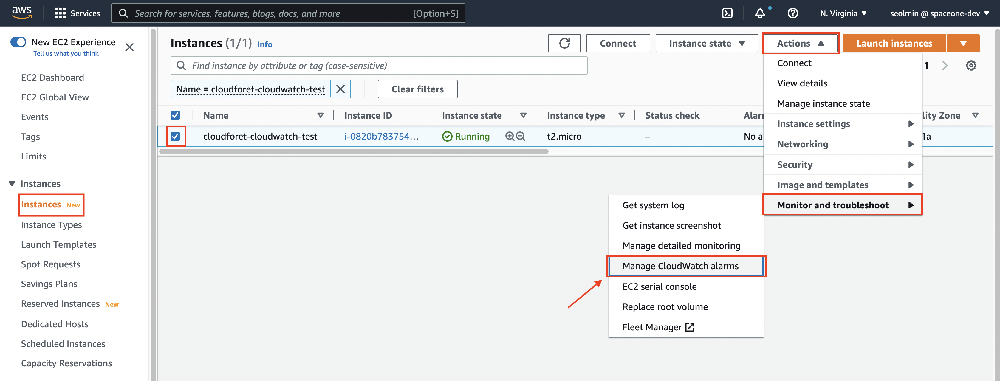
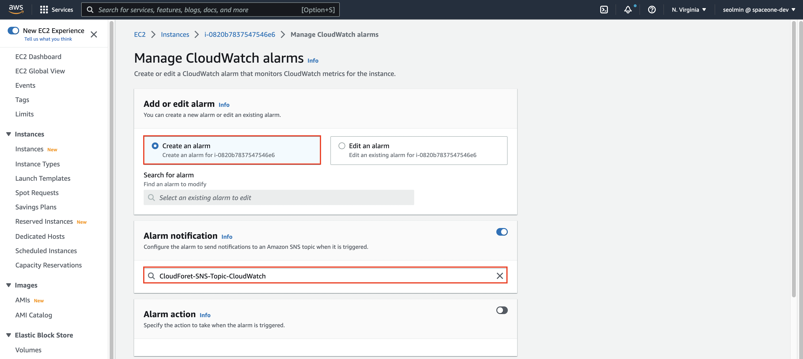
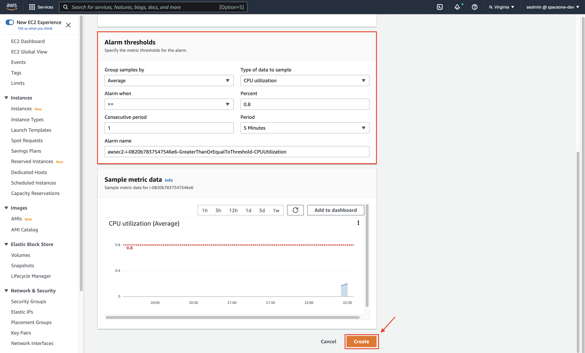
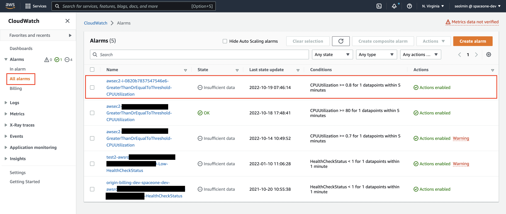
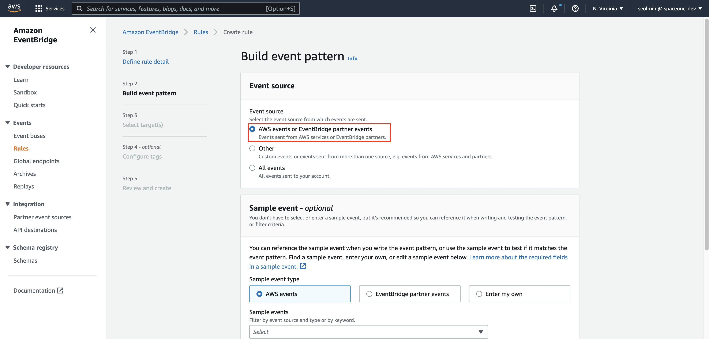
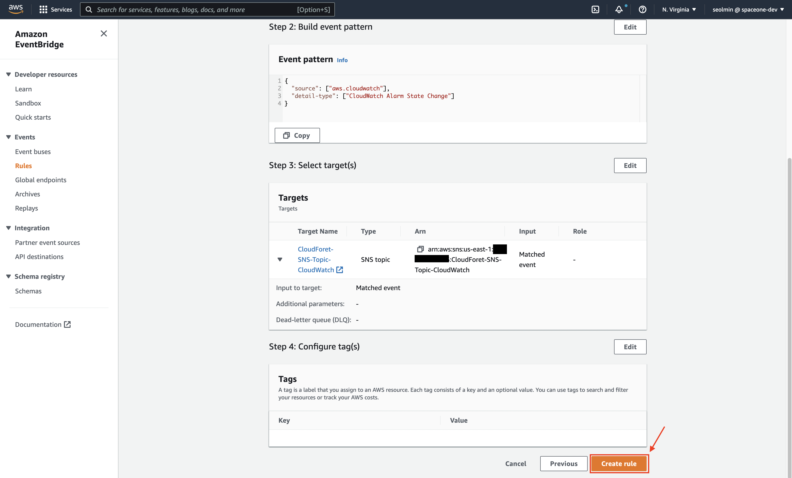

## Flow for CloudWatch Setup
Events that occur in CloudWatch are delivered to AWS SNS Topic in two ways.

* When sending an event that occurs to an AWS SNS topic after setting CloudWatch notifications **in a specific EC2 instance**
* **When using AWS EventBridge** to send CloudWatch notifications that occur in the region to AWS SNS Webhook Topic

After that, you can use CloudWatch Events in CloudForet   
by sending the event generated through two methods to AWS-SNS-Webhook of SpaceONE, a subscriber of the topic.

Settings proceed in reverse order. So, follow the order below.  

[1. AWS SNS Webhook Plugin Settings](#1-aws-sns-webhook-plugin-settings)    
[2. AWS SNS topic and subscription settings](#2-aws-sns의-topic-and-subscription-settings)  
[3. Setting up CloudWatch Notifications on a Specific EC2 Instance](#3-setting-up-cloudwatch-notification-on-a-specific-ec2-instance)  
[4. Setting Up CloudWatch Notifications in AWS EventBridge](#4-setting-up-cloudwatch-notifications-in-aws-eventbridge)

If you want to collect CloudWatch alarms that fire on a specific EC2 Instance, the setup sequence is [ 1 - 2 - 3 ].  
If you want to use EventBridge to collect all CloudWatch alarms that occur in that region, the setup sequence is [ 1 - 2 - 4 ].

<br>
<br>

## 1. AWS SNS Webhook Plugin Settings

Set up the AWS SNS Webhook Plugin in your project to receive CloudWatch notifications through the SpaceONE console.  
(1) [Project] > [Alert] > Click the [Activate Alert] button.



(2) [Webhook] > Click the [ + Add] button to bring up the list of webhooks to use.


(3) Create a webhook [Name], select [AWS SNS], and click the [Confirm] button to create the webhook.


(4) Check the created AWS SNS webhook and copy the `Webhook URL`.  
&nbsp;&nbsp;&nbsp;&nbsp;&nbsp;The copied URL is used to set the Subscrtion target in [2. AWS SNS topic and subscription settings](#2-aws-sns의-topic-and-subscription-settings).



<br>
<br>

## 2. AWS SNS topic and subscription settings

### AWS SNS Description

AWS Simple Notification Service (SNS) is a managed service that sends messages from Publishers to Subscribers.    
Publishers communicate asynchronously with subscribers by sending messages to topics, which are logical access points and communication channels.

Deliver CloudWatch event to AWS SNS Webhook Plugin to CloudForet using **HTTPS protocol** as the endpoint type.  
**The URL applied to HTTPS is the webhook URL created after creating the AWS SNS webhook Plugin.**

You can receive CloudWatch events through topic settings and deliver events to AWS SNS webhooks through subscription settings.

To set up AWS SNS, proceed in the order below.

[2.1 AWS SNS topic settings](#21-aws-sns-topic-settings)  
[2.2 AWS SNS Subscription settings](#22-aws-sns-subscription-settings)

<br>

### 2.1 AWS SNS topic settings

(1) AWS console login > Search `SNS` > Click [Simple Notification Service].


(2) [Topics]  > Click the [Create Topic] button.


(3) Select [Standard] for the type, write [Name] and [Display name], and click the [Create] button at the bottom.


(4) Check that the topic was created successfully.


<br>

### 2.2 AWS SNS Subscription settings

Let's try to subscribe to the created topic.     
The webhook URL created in [1. AWS SNS Webhook Plugin Settings](#1-aws-sns-webhook-plugin-settings) is used while creating the subscription.      
After the subscription setup is complete, AWS SNS and CloudForet's AWS SNS Webhook will be able to communicate with each other.

Now let's go step by step.

(1) Click the [Create Subscription] button.



(2) First, [Topic ARN] selects the created topic.    
&nbsp;&nbsp;&nbsp;&nbsp;&nbsp;[Protocol] chooses HTTPS to receive the webhook URL.  
&nbsp;&nbsp;&nbsp;&nbsp;&nbsp;For [Endpoint], enter the `Webhook URL` obtained in [1. AWS SNS Webhook Plugin Settings](#1-aws-sns-webhook-plugin-settings).    
&nbsp;&nbsp;&nbsp;&nbsp;&nbsp;After that, click the [Create Subscription] button.


(3) If the subscription is successfully created and successfully connected with CloudForet's AWS SNS Webhook plugin,  
&nbsp;&nbsp;&nbsp;&nbsp;&nbsp;you can see that [Status] is output as `Confirmed`.



Now all the settings in AWS SNS are finished.

<br>
<br>

## 3. Setting up CloudWatch Notifications on a Specific EC2 Instance

(1) Click on AWS EC2 `Instances` > Select a specific instance > Click `Actions` > Click on `Monitor and troubleshoot`  
&nbsp;&nbsp;&nbsp;&nbsp;&nbsp;> Click the `Manage CloudWatch alarms` button.



(2) Choose `Create an alarm` > `Alarm notification` selects the previously created topic   
&nbsp;&nbsp;&nbsp;&nbsp;&nbsp;> Set theresholds to use in `Alarm thresholds` (ex. CPU uilization >= 80%)  
&nbsp;&nbsp;&nbsp;&nbsp;&nbsp;> Click the `Create` button.





(3) Click the AWS CloudWatch console > Click `All alarms` > Check whether the set alarm is well created.



Now, you are all set up to receive CloudWatch alarms from CloudForet.

[1. AWS SNS Webhook Plugin Settings](#1-aws-sns-webhook-plugin-settings)    
[2. AWS SNS topic and subscription settings](#2-aws-sns의-topic-and-subscription-settings)  
[3. Setting up CloudWatch Notifications on a Specific EC2 Instance](#3-setting-up-cloudwatch-notification-on-a-specific-ec2-instance)

If you set up in the above order, you can receive alarms from specific EC2 Instances with CloudForet's SNS webhook plugin.

<br>
<br>

## 4. Setting Up CloudWatch Notifications in AWS EventBridge

(1) Click on AWS EventBridge > Click `Rules` > Click the `Create rule` button.


(2) Write `Name` and `Description` > Click the Next button.


(3) Click `AWS events or EventBridge partner events` in the event source  
&nbsp;&nbsp;&nbsp;&nbsp;&nbsp;> Select `AWS services` in Event pattern > Search and select `CloudWatch` > Select `CloudWatch Alarm State Change`     
&nbsp;&nbsp;&nbsp;&nbsp;&nbsp;> Check if the event pattern is set appropriately > Click the Next button.




[Ref] If you don't want to receive all CloudWatch in that region and want to receive alarms for specific Instances, you can set up Custom patterns yourself.   
&nbsp;&nbsp;&nbsp;&nbsp;&nbsp;&nbsp;&nbsp;&nbsp;&nbsp;Add resource information of Alarm set in CloudWatch. The example below corresponds to receiving alarms from 3 specific instances.
```json
{
  "source": [
    "aws.cloudwatch"
  ],
  "detail-type": [
    "CloudWatch Alarm State Change"
  ],
  "resources": [
    "arn:aws:cloudwatch:us-east-1:123456789012:alarm:awsec2-i-123456789047546e6-GreaterThanOrEqualToThreshold-CPUUtilization",
    "arn:aws:cloudwatch:us-east-1:123456789012:alarm:awsec2-i-231456789047546e6-GreaterThanOrEqualToThreshold-CPUUtilization",
    "arn:aws:cloudwatch:us-east-1:123456789012:alarm:awsec2-i-321456789047546e6-GreaterThanOrEqualToThreshold-CPUUtilization"
  ]
}
```

(4) Click on `AWS service` > Choose `SNS topic` > Select the topic you created earlier > Click the Next button.   
&nbsp;&nbsp;&nbsp;&nbsp;&nbsp;> Next, proceed if you need to set up tags and click the Next button.


(5) After checking the information set in (2~4), click the `Create rule` button.



(6) If the above settings are completed, you can check the created rule.


Now, you are all set up to receive CloudWatch alarms from CloudForet.

[1. AWS SNS Webhook Plugin Settings](#1-aws-sns-webhook-plugin-settings)    
[2. AWS SNS topic and subscription settings](#2-aws-sns의-topic-and-subscription-settings)   
[4. Setting Up CloudWatch Notifications in AWS EventBridge](#4-setting-up-cloudwatch-notifications-in-aws-eventbridge)

If you set up in the above order, you can receive alarms from specific EC2 Instances with CloudForet's SNS webhook plugin.