## CloudWatch 설정을 위한 전체 Flow
CloudWatch에서 발생하는 이벤트는 2가지 방법으로 AWS SNS Topic에 전달됩니다.

* **특정 EC2 Instance에서 CloudWatch 알림 설정 후** AWS SNS Topic으로 발생된 이벤트를 보내는 경우
* **AWS EventBridge를 사용해** 해당 리전에서 발생하는 CloudWatch 알림을 AWS SNS Webhook Topic으로 보내는 경우

이후 2가지 방법을 통해 발생된 이벤트를 해당 Topic의 Subscriber인 SpaceONE의 AWS-SNS-Webhook으로 보내  
CloudWatch 이벤트를 CloudForet에서 사용할 수 있습니다.

설정은 역순으로 진행합니다. 따라서 아래와 순서를 따릅니다.  

[1. AWS SNS Webhook 플러그인 설정](#1-aws-sns-webhook-플러그인-설정)    
[2. AWS SNS의 Topic과 Subscription 설정](#2-aws-sns의-topic과-subscription-설정)  
[3. 특정 EC2 Instance에서 CloudWatch 알림 설정](#3-특정-ec2-instance에서-cloudwatch-알림-설정)  
[4. AWS EventBridge에서 CloudWatch 알림 설정](#4-aws-eventbridge에서-cloudwatch-알림-설정)

특정 EC2 Instance에서 발생하는 CloudWatch 경보를 수집하고 싶은 경우, 설정 순서는 [ 1 - 2 - 3 ] 순서를 따릅니다.  
EventBridge를 사용해 해당 리전에 발생하는 모든 CloudWatch 경보를 수집하고 싶은 경우, 설정 순서는 [ 1 - 2 - 4 ] 순서를 따릅니다.

<br>
<br>

## 1. AWS SNS Webhook 플러그인 설정

SpaceONE 콘솔을 통해 CloudWatch 알림을 받을 프로젝트에 AWS SNS Webhook Plugin을 설정합니다.
(1) [프로젝트] > [얼럿] > [얼럿 활성화] 버튼을 클릭합니다.

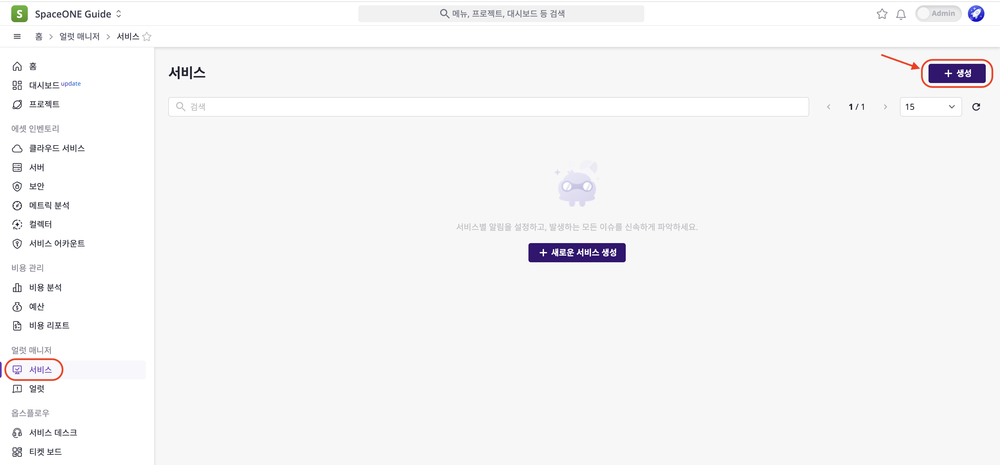

(2) [웹훅] > [ + 추가] 버튼을 클릭하여 사용할 웹훅의 목록을 불러옵니다.

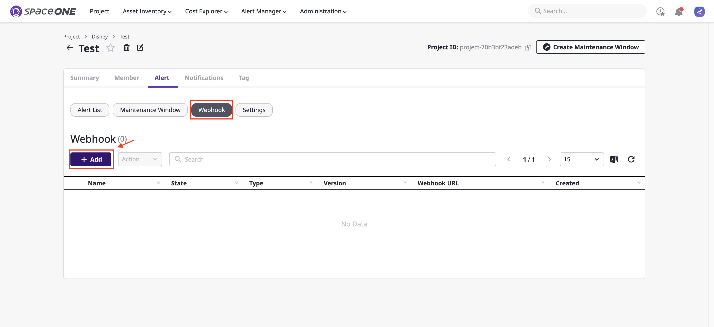

(3) 웹훅 [이름]을 작성하고 [AWS SNS Webhook]을 선택한 후 [확인] 버튼을 클릭해 웹훅을 생성합니다.

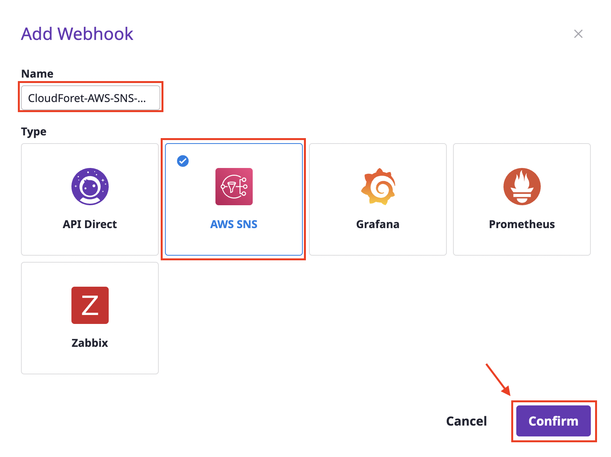

(4) 생성된 AWS SNS Webhook을 확인하고 `Webhook URL`을 복사합니다.  
&nbsp;&nbsp;&nbsp;&nbsp;&nbsp;복사된 URL은 [2. AWS SNS의 Topic과 Subscription 설정](#2-aws-sns의-topic과-subscription-설정)에서 Subscrtion 타겟을 설정하는데 사용됩니다.

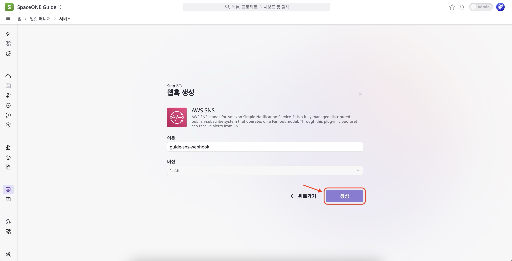

<br>
<br>

## 2. AWS SNS의 Topic과 Subscription 설정

### AWS SNS 설명

AWS SNS(Simple Notification Service)는 Publisher에서 Subscriber로 메세지를 전송하는 관리형 서비스입니다.  
Publisher는 logical access point, communication channel인 Topic에 메세지를 보내 subscriber와 비동기적으로 통신합니다.

Endpoint 타입으로 **HTTPS 프로토콜**을 사용해 CloudForet에 AWS SNS Webhook Plugin에 CloudWatch event를 전달합니다.  
**HTTPS에 적용된 URL은 AWS SNS webhook Plugin을 생성 후 만들어지는 Webhook URL입니다.**

Topic 설정을 통해 CloudWatch event를 수신하며 Subscription 설정을 통해 AWS SNS Webhook으로 event를 전달할 수 있습니다.

AWS SNS 설정을 위해 아래 순서에 맞게 진행합니다.

[2.1 AWS SNS의 Topic 설정](#21-aws-sns의-topic-설정)  
[2.2 AWS SNS의 Subscription 설정](#22-aws-sns의-subscription-설정)

<br>

### 2.1 AWS SNS의 Topic 설정

(1) AWS 콘솔 로그인 > `SNS` 검색 > Simple Notification Service을 클릭합니다.

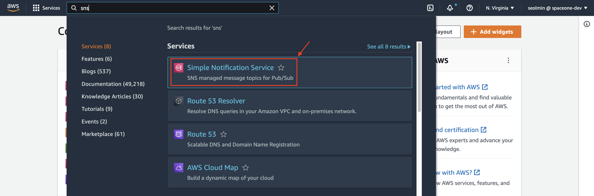

(2) [주제]  > [주제 생성] 버튼을 클릭합니다.

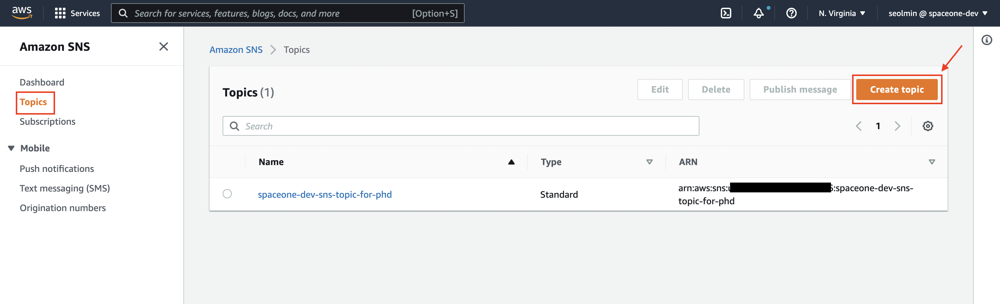

(3) 유형은 [표준]을 선택하고 [이름]과 [표시 이름]을 작성한 후 하단의 [생성] 버튼을 클릭합니다.

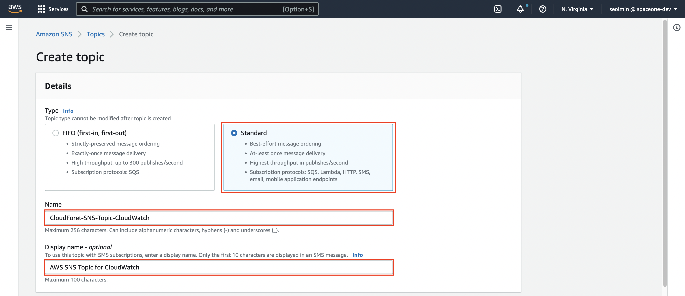

(4) 주제가 정상적으로 생성되었는 지 확인합니다.

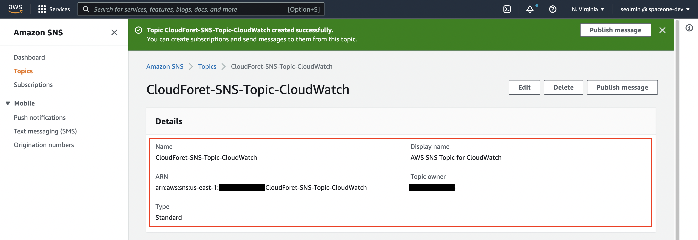

<br>

### 2.2 AWS SNS의 Subscription 설정

생성된 주제를 구독해보록 합니다.   
구독을 생성하면서 [1. AWS SNS Webhook 플러그인 설정](#1-aws-sns-webhook-플러그인-설정)에서 생성된 Webhook URL 이 사용됩니다.  
구독 설정이 완료되면 AWS SNS와 클라우드포레의 AWS SNS Webhook과 서로 통신할 수 있게 됩니다.   

이제 단계별로 진행해 보겠습니다.

(1) [구독 생성] 버튼을 클릭 합니다.


(2) 먼저, [주제 ARN]은 생성된 주제를 선택합니다.  
&nbsp;&nbsp;&nbsp;&nbsp;&nbsp;[프로토콜]은 Webhook URL을 받기 위해 HTTPS를 선택합니다.  
&nbsp;&nbsp;&nbsp;&nbsp;&nbsp;[엔드포인트]는 [1. AWS SNS Webhook 플러그인 설정](#1-aws-sns-webhook-플러그인-설정)에서 획득한 `Webhook URL` 을 입력합니다.  
&nbsp;&nbsp;&nbsp;&nbsp;&nbsp;이후 [구독 생성] 버튼을 클릭 합니다.

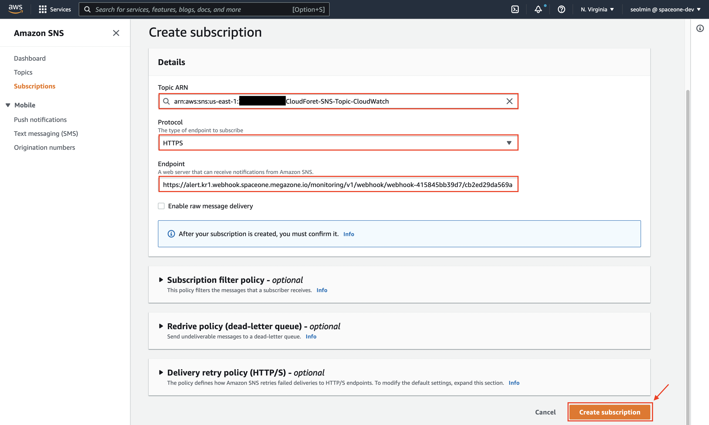

(3) 구독이 정상적으로 생성되고 클라우드포레의 AWS SNS Webhook 플러그인과 정상적으로 연결 되었다면  
&nbsp;&nbsp;&nbsp;&nbsp;&nbsp;[상태]가 확인됨 으로 출력됨을 확인할 수 있습니다.


이제 AWS SNS에서의 설정은 모두 끝났습니다.

<br>
<br>

## 3. 특정 EC2 Instance에서 CloudWatch 알림 설정

(1) AWS EC2 `Instances` 클릭 > 특정 Instance 선택 > `Actions` 클릭 > `Monitor and troubleshoot` 클릭  
&nbsp;&nbsp;&nbsp;&nbsp;&nbsp;> `Manage CloudWatch alarms` 버튼을 클릭 합니다.


(2) `Create an alarm` 선택 > `Alarm notification`은 이전에 생성한 Topic을 선택  
&nbsp;&nbsp;&nbsp;&nbsp;&nbsp;> `Alarm thresholds`에서 사용할 theresholds를 설정 (ex. CPU uilization >= 80%)  
&nbsp;&nbsp;&nbsp;&nbsp;&nbsp;> `Create` 버튼을 클릭 합니다.


(3) AWS CloudWatch 콘솔 클릭 > `All alarms` 클릭 > 설정한 알람이 잘 생성 되었는 지 확인 합니다.


이제, CloudForet에서 CloudWatch 알람을 수신 위한 모든 설정이 끝났습니다.

[1. AWS SNS Webhook 플러그인 설정](#1-aws-sns-webhook-플러그인-설정)    
[2. AWS SNS의 Topic과 Subscription 설정](#2-aws-sns의-topic과-subscription-설정)  
[3. 특정 EC2 Instance에서 CloudWatch 알림 설정](#3-특정-ec2-instance에서-cloudwatch-알림-설정)

위의 순서로 설정을 하면 CloudForet의 SNS webhook 플러그인으로 특정 EC2 Instance의 알람을 수신할 수 있습니다.

<br>
<br>

## 4. AWS EventBridge에서 CloudWatch 알림 설정

(1) AWS EventBridge 클릭 > `Rules` 클릭 > `Create rule` 버튼을 클릭 합니다.

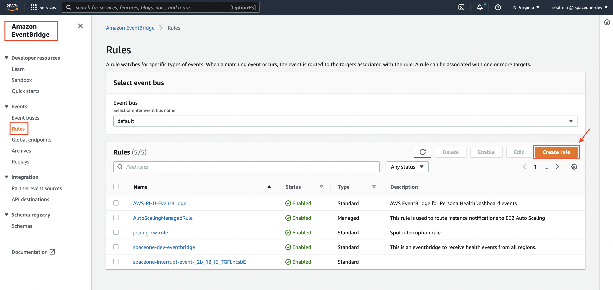

(2) `Name`과 `Description` 작성 > Next 버튼을 클릭 합니다.

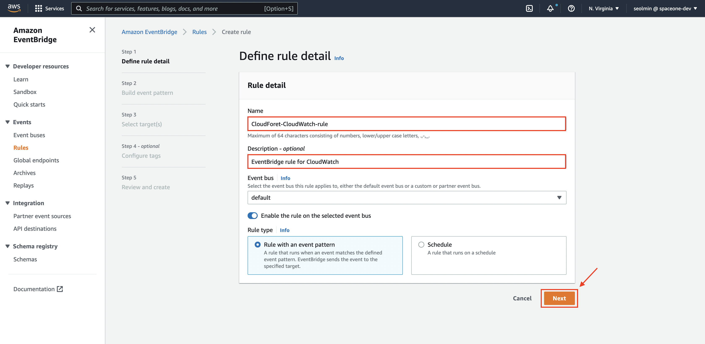

(3) Event source에서 `AWS events or EventBridge partner events` 클릭  
&nbsp;&nbsp;&nbsp;&nbsp;&nbsp;> Event pattern에서 `AWS services` 선택 > `CloudWatch` 검색 후 선택 > `CloudWatch Alarm State Change` 선택   
&nbsp;&nbsp;&nbsp;&nbsp;&nbsp;> Event pattern이 알맞게 설정 되었는 지 확인 > Next 버튼을 클릭 합니다.


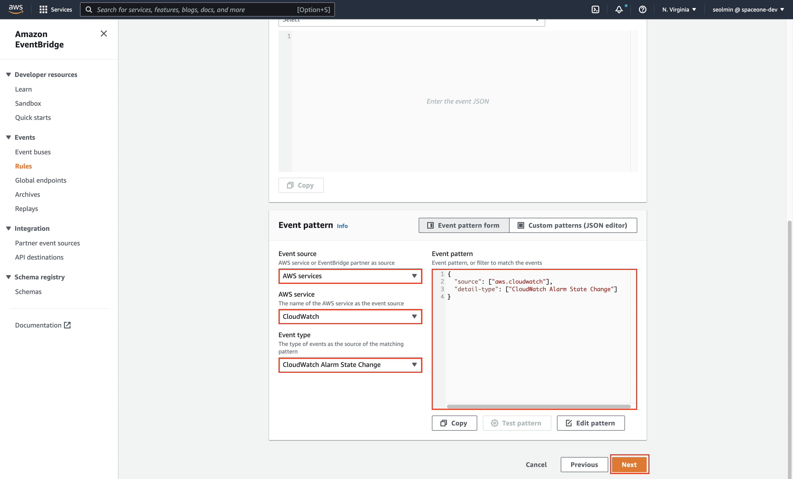

[참고] 해당 리전의 모든 CloudWatch를 받지 않고 특정 Instances의 알람을 수신하고 싶은 경우 직접 Custom patterns을 설정합니다.  
&nbsp;&nbsp;&nbsp;&nbsp;&nbsp;&nbsp;&nbsp;&nbsp;&nbsp;&nbsp;CloudWatch에서 설정한 Alarm의 resource 정보를 추가합니다. 아래 예시는 3개의 특정 Instace의 알람을 수신하는 경우에 해당합니다.
```json
{
  "source": [
    "aws.cloudwatch"
  ],
  "detail-type": [
    "CloudWatch Alarm State Change"
  ],
  "resources": [
    "arn:aws:cloudwatch:us-east-1:123456789012:alarm:awsec2-i-123456789047546e6-GreaterThanOrEqualToThreshold-CPUUtilization",
    "arn:aws:cloudwatch:us-east-1:123456789012:alarm:awsec2-i-231456789047546e6-GreaterThanOrEqualToThreshold-CPUUtilization",
    "arn:aws:cloudwatch:us-east-1:123456789012:alarm:awsec2-i-321456789047546e6-GreaterThanOrEqualToThreshold-CPUUtilization"
  ]
}
```

(4) `AWS service` 클릭 > `SNS topic` 선택 > 이전에 생성한 Topic 선택 > Next 버튼을 클릭 합니다.  
&nbsp;&nbsp;&nbsp;&nbsp;&nbsp;> 다음으로 태그 설정이 필요한 경우 진행하고 Next 버튼을 클릭합니다.

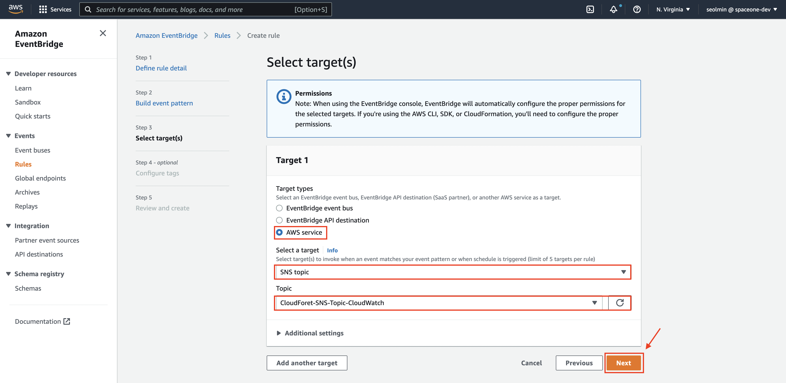

(5) (2~4)에서 설정한 정보를 확인한 후 `Create rule` 버튼을 클릭합니다.


(6) 위의 설정이 끝났다면 생성된 rule을 확인할 수 있습니다.

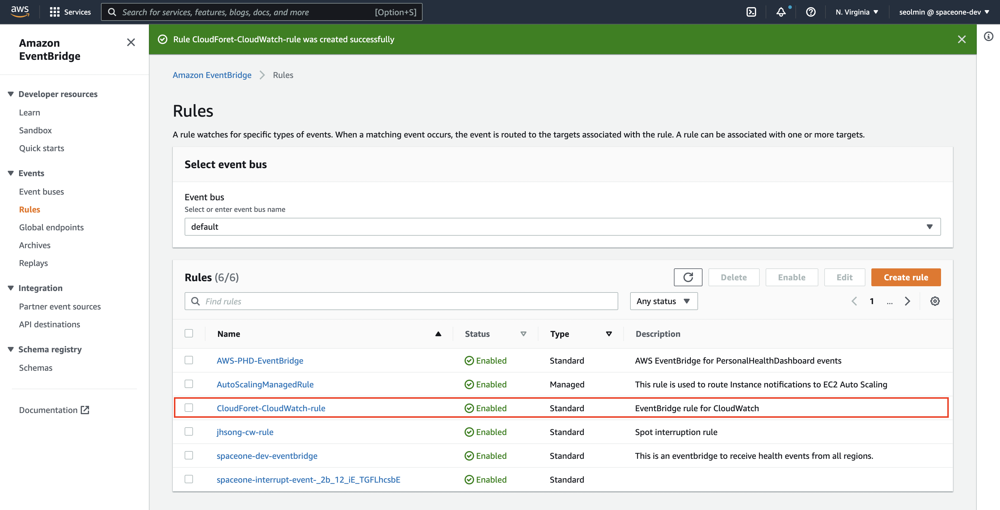

이제, CloudForet에서 CloudWatch 알람을 수신 위한 모든 설정이 끝났습니다.

[1. AWS SNS Webhook 플러그인 설정](#1-aws-sns-webhook-플러그인-설정)    
[2. AWS SNS의 Topic과 Subscription 설정](#2-aws-sns의-topic과-subscription-설정)   
[4. AWS EventBridge에서 CloudWatch 알림 설정](#4-aws-eventbridge에서-cloudwatch-알림-설정)

위의 순서로 설정을 하면 CloudForet의 SNS webhook 플러그인으로 리전의 CloudWatch 알람을 수신할 수 있습니다.