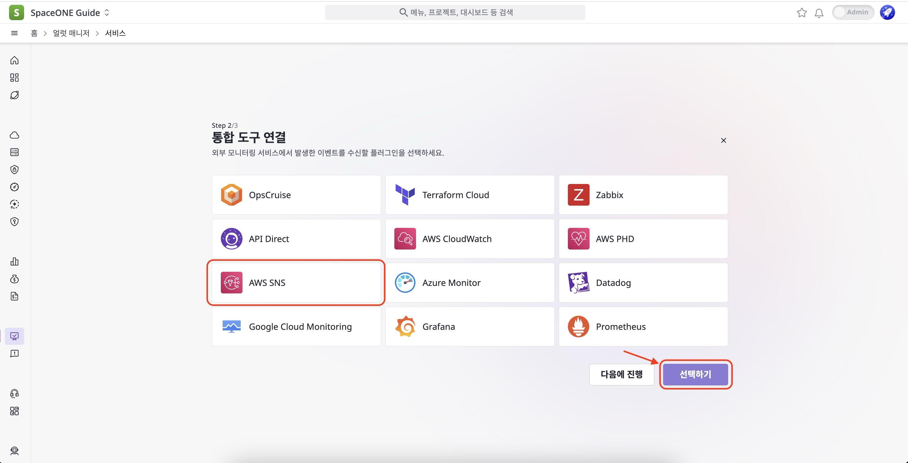
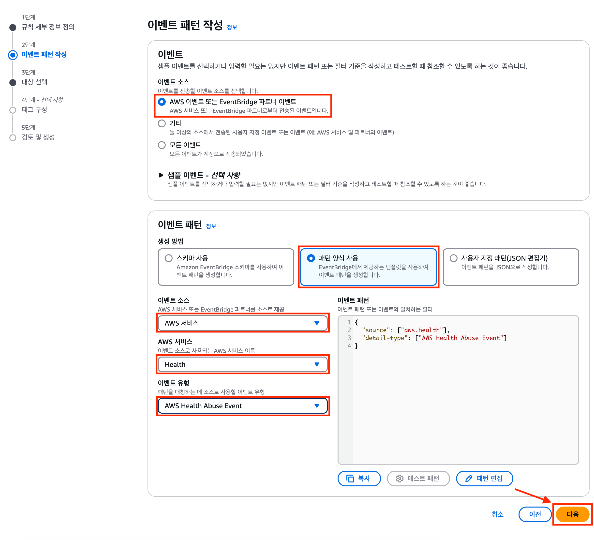

## PHD 설정을 위한 전체 Flow

그림에서 볼 수 있듯이 PHD 이벤트가 발생했을 때  
AWS EventBridge > AWS SNS > AWS SNS Webhook 순으로 데이터가 전달됩니다.  
서로 의존 관계이기 때문에 설정은 **역순**으로 진행합니다.


따라서 **PHD 이벤트**를 받기 위해 PHD pipeline 구축은 다음과 같습니다.

[1. AWS SNS Webhook 플러그인 설정](#1-aws-sns-webhook-플러그인-설정)    
[2. AWS SNS의 Topic과 Subscription 설정](./PersonalHealthDashboard.md/#2-aws-sns의-topic과-subscription-설정)  
[3. AWS Eventbridge 설정](#3-aws-eventbridge-설정)

<br>
<br>


## 1. AWS SNS Webhook 플러그인 설정

클라우드포레 콘솔을 통해 PHD 알림을 받을 프로젝트에 AWS SNS Webhook Plugin을 설정합니다.

(1) [얼럿 매니저] > [서비스] > [생성] 버튼을 클릭합니다.


(2) 서비스 [이름], [키], [멤버], [설명]을 작성하고 [생성] 버튼을 클릭해 새로운 얼럿 매니저 서비스를 생성합니다.


(3) 웹훅 [AWS SNS]을 선택한 후 [선택하기] 버튼을 클릭합니다.



(4) AWS SNS Webhook의 [이름]을 작성하고 [생성] 버튼을 클릭하여 웹훅을 생성합니다.  


(5) [웹훅 URL 복사하기] 버튼을 클릭하여 생성된 웹훅의 URL을 클립보드에 복사합니다.  
&nbsp;&nbsp;&nbsp;&nbsp;&nbsp;복사된 URL은 [2. AWS SNS의 Topic과 Subscription 설정](./PersonalHealthDashboard.md/#2-aws-sns의-topic과-subscription-설정)에서 subscription 타겟을 설정하는데 사용됩니다.


&nbsp;&nbsp;&nbsp;&nbsp;&nbsp;웹훅 URL은 [얼럿 매니저] > [서비스] > [웹훅] > [상세 정보] > [Webhook URL] 에서 나중에 다시 복사할 수 있습니다.


(6) 얼럿을 알림으로 받을 수 있도록 알림을 설정합니다.  
&nbsp;&nbsp;&nbsp;&nbsp;&nbsp;또는 [다음에 진행] 버튼을 클릭하여 스킵한 후 나중에 설정할 수 있습니다.

 

<br>
<br>


## 2. AWS SNS의 Topic과 Subscription 설정

### AWS SNS 설명

AWS SNS(Simple Notification Service)는 Publisher에서 Subscriber로 메세지를 전송하는 관리형 서비스입니다.  
Publisher는 logical access point, communication channel인 Topic에 메세지를 보내 subscriber와 비동기적으로 통신합니다.

Endpoint 타입으로**HTTPS 프로토콜**을 사용해 SpaceONE에 AWS SNS Webhook Plugin에 PHD event를 전달합니다.  
**HTTPS에 적용된 URL은 AWS SNS webhook Plugin을 생성 후 만들어지는 Webhook URL입니다.**

Topic 설정을 통해 AWS EventBridge로부터 PHD event를 수신하며 Subscription 설정을 통해 AWS SNS Webhook으로 event를 전달할 수 있습니다.

AWS SNS 설정을 위해 아래 순서에 맞게 진행합니다.

[2.1 AWS SNS의 Topic 설정](./PersonalHealthDashboard.md/#21-aws-sns의-topic-설정)  
[2.2 AWS SNS의 Subscription 설정](./PersonalHealthDashboard.md/#22-aws-sns의-subscription-설정)

<br>

### 2.1 AWS SNS의 Topic 설정

(1) AWS 콘솔 로그인 > SNS 검색 > Simple Notification Service을 클릭합니다.


(2) [주제]  > [주제 생성] 버튼을 클릭합니다.


(3) 유형은 [표준]을 선택하고 [이름]과 [표시 이름]을 작성한 후 하단의 [생성] 버튼을 클릭합니다.


(4) 주제가 정상적으로 생성되었는 지 확인합니다.


<br>

### 2.2 AWS SNS의 Subscription 설정

생성된 주제를 구독해보록 합니다.   
구독을 생성하면서 [1. AWS SNS Webhook 플러그인 설정](#1-aws-sns-webhook-플러그인-설정)에서 생성된 Webhook URL 이 사용됩니다.  
구독 설정이 완료되면 AWS SNS와 클라우드포레의 AWS SNS Webhook과 서로 통신할 수 있게 됩니다.   

이제 단계별로 진행해 보겠습니다.

(1) [구독 생성] 버튼을 클릭 합니다.


(2) 먼저, [주제 ARN]은 생성된 주제를 선택합니다.  
&nbsp;&nbsp;&nbsp;&nbsp;&nbsp;[프로토콜]은 Webhook URL을 받기 위해 HTTPS를 선택합니다.  
&nbsp;&nbsp;&nbsp;&nbsp;&nbsp;[엔드포인트]는 [1. AWS SNS Webhook 플러그인 설정](#1-aws-sns-webhook-플러그인-설정)에서 획득한 `Webhook URL` 을 입력합니다.  
&nbsp;&nbsp;&nbsp;&nbsp;&nbsp;이후 [구독 생성] 버튼을 클릭 합니다.


(3) 구독이 정상적으로 생성되고 클라우드포레의 AWS SNS Webhook 플러그인과 정상적으로 연결 되었다면  
&nbsp;&nbsp;&nbsp;&nbsp;&nbsp;[상태]가 확인됨 으로 출력됨을 확인할 수 있습니다.


다음으로 AWS EventBridge 설정을 통해 생성한 주제로 PHD 이벤트를 받을 수 있도록 설정합니다.

<br>
<br>


## 3. AWS Eventbridge 설정

### 개요
PHD(Health) 이벤트가 발생하면 AWS EventBridge로 PHD 이벤트를 수신할 수 있습니다.  
AWS EventBridge 설정 시 주의할 점은 PHD 이벤트를 받으려는 **각 리전(Region)마다 이벤트룰(EventRule)을 설정**합니다.  
그리고 Global 리전에 대한 PHD event(리전에 상관없는 PHD 이벤트)를 받기 위해서는.  
버지니아 북부(**us-east-1)에 이벤트 브릿지(EventBridge)를 설정**합니다. 

또한, 각 리전 마다 생성된 이벤트 브릿지를 버지니아 북부(us-east-1)로 라우팅 해주기 위해 이벤트 버스(EventBus)**를 사용**합니다.  
이렇게 설정함으로써 AWS EventBridge의 이벤트룰 N개, AWS SNS 1개 구조를 통해 다수 리전의 Health 이벤트를 수신할 수 있습니다.

다음의 예시를 들 수 있습니다.

```markdown
서울 지역에 EC2를 운영중이며 시드니 지역에 S3 저장소를 가지고 있고,  
운영중인 지역(서울, 시드니)의 PHD 이벤트를 받고 싶으며 Global PHD 이벤트도 수신하고 싶다고 가정해볼 수 있습니다.

- Seoul 리전에 EC2를 운영  
- Sydney 리전에 S3를 운영

위의 경우, 아래와 같이 3개의 이벤트룰 생성을 통해 원하는 요구조건을 충족할 수 있습니다.

- EventRule(us-east-1)  
- EventRule(ap-northeast-2)  
- EventRule(ap-southeast-2)

이때, 다른 2종류의 타겟 설정이 필요합니다.   
이벤트룰(us-east-1)은 이미 생성된 SNS를 타겟으로합니다.  
이벤트룰(ap-northeast-2)의 타겟은 SNS가 아닌 버지니아 북부(us-east-1) 이벤트 버스의 default입니다.   
마찬가지로 EventRule(ap-southeast-2)의 타겟은 SNS가 아닌 버지니아 북부(us-east-1) 이벤트 버스의 default입니다.

다음의 순서로 설정을 진행합니다.

1. 이벤트룰(us-east-1) 생성 후 AWS SNS를 타겟으로 설정  
2. 이벤트룰(ap-northeast-2) 생성 후 버지니아 북부(us-east-1) 이벤트 버스의 default를 타겟으로 설정  
3. 이벤트룰(ap-southeast-2) 생성 후 버지니아 북부(us-east-1) 이벤트 버스의 default를 타겟으로 설정

실제 서울의 EC2에 대해 Health 이벤트가 발생하면 이벤트룰(ap-northeast-2)에서 최초 수신 후    
버지니아 북부(us-east-1) 이벤트 버스에 전달이 되며 이벤트룰(us-east-1)에서 수신하게 됩니다.  
이후 설정된 AWS SNS로 이벤트가 전달되며 최종적으로 AWS SNS Webhoook에 전달되어 클라우드포레에서 Alert이 생성됩니다.  
```

이제, 단계별로 EventBridge의 EventRule 설정방법을 알아보도록 하겠습니다.  
[3.1 AWS EventBridge Global 설정](./PersonalHealthDashboard.md/#31-aws-eventbridge-global-설정)  
[3.2 AWS EventBridge Non-Global 설정](./PersonalHealthDashboard.md/#32-aws-eventbridge-non-global-설정)

<br>

### 3.1 AWS EventBridge Global 설정

(1) AWS 콘솔 로그인 > EventBridge 검색 > [Amazon EventBridge] 클릭 합니다.


(2) [규칙] > [규칙 생성] 버튼을 클릭합니다.


(3) [이름], [설명](선택 사항)을 작성하고 [다음] 버튼을 클릭합니다.


(3-1) [이벤트 소스]는 [AWS 이벤트 또는 EventBridge 파트너 이벤트]를 선택합니다.    
(3-2) [이벤트 패턴]에서 [이벤트 소스]는 `AWS 서비스` , [AWS 서비스]는 `Health`  
&nbsp;&nbsp;&nbsp;&nbsp;&nbsp;&nbsp;&nbsp;&nbsp;&nbsp;그리고 [이벤트 유형]은 `AWS Health Abuse Event` 를 선택합니다.



(3-3) [대상 선택]에서 [대상 유형]은 AWS 서비스 , [대상 선택]은 SNS 주제를 선택합니다.  
&nbsp;&nbsp;&nbsp;&nbsp;&nbsp;&nbsp;&nbsp;&nbsp;&nbsp;그리고 [주제]는 2.1 AWS SNS의 Topic 설정(링크)에서 설정한 CloudForet-SNS-Topic을 선택합니다.


(3-4) [태그 구성]은 사용할 태그가 있다면 추가할 수 있습니다.


(3-5) [검토 및 생성]에서 설정한 모든 사항을 확인할 수 있습니다. 이상이 없다면 [규칙 생성] 버튼을 클릭 합니다.


Global PHD 이벤트를 받기 위한 이벤트브릿지 설정은 모두 완료되었습니다.

<br>

### 3.2 AWS EventBridge Non-Global 설정
이제, Global이 아닌 이벤트를 받는 설정을 해보겠습니다.  
버지니아 북부(us-east-1)이 아닌 시드니(ap-southest-2)로 진행합니다.

(1) 리전을 [시드니]로 변경하고 [규칙] > [규칙 생성] 버튼을 클릭 합니다.


(2) [이름], [설명](선택 사항)을 작성하고 [다음] 버튼을 클릭합니다.


(3-1) [이벤트 소스]는 [AWS 이벤트 또는 EventBridge 파트너 이벤트]를 선택합니다.  
(3-2) [이벤트 패턴]에서 [이벤트 소스]는 `AWS 서비스` , [AWS 서비스]는 `Health`  
&nbsp;&nbsp;&nbsp;&nbsp;&nbsp;&nbsp;&nbsp;&nbsp;&nbsp;그리고 [이벤트 유형]은 `특정 상태 이벤트` 를 선택합니다.


(3-3) [대상 선택]에서 [대상 유형]은 `EventBridge 이벤트 버스` 를 선택 합니다.  
&nbsp;&nbsp;&nbsp;&nbsp;&nbsp;&nbsp;&nbsp;&nbsp;&nbsp;[대상 유형]은 `다른 계정 또는 리전의 이벤트 버스`를 선택 합니다.  
&nbsp;&nbsp;&nbsp;&nbsp;&nbsp;&nbsp;&nbsp;&nbsp;&nbsp;[대상 이벤트 버스]는 **버지니아 북부(us-east-1) 기본(default) 이벤트 버스의 ARN을** 기입 합니다.  
&nbsp;&nbsp;&nbsp;&nbsp;&nbsp;&nbsp;&nbsp;&nbsp;&nbsp;버지니아 북부(us-east-1) 이벤트 버스의 ARN은 아래 그림을 참고 하십시오.


(3-4) [태그 구성]은 사용할 태그가 있다면 추가할 수 있습니다. 


(3-5) [검토 및 생성]에서 설정한 모든 사항을 확인할 수 있습니다. 이상이 없다면 [규칙 생성] 버튼을 클릭 합니다.


Global PHD 이벤트를 받기 위한 설정 그리고 Non-Global PHD 이벤트를 받기 위한 설정 모두 알아 보았습니다.  
위의 가이드 절차에 맞춰 진행하면 Global PHD 이벤트와 시드니에서 발생하는 PHD 이벤트를 수신할 수 있는 파이프라인 구축이 완료 되었습니다.

이제, 클라우드포레에서 **PHD 이벤트에 대한 Alert을 받을 수 있습니다.**
